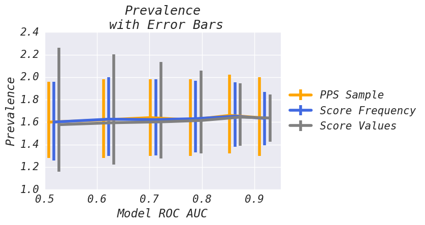
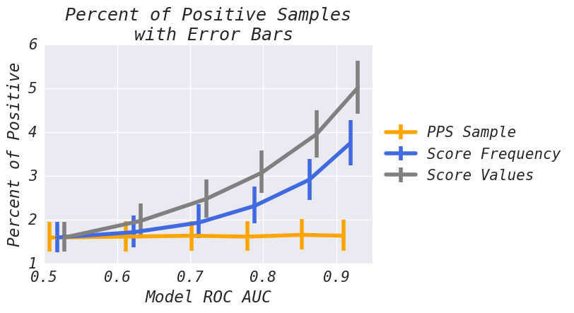

# ml_sampler - Model Assisted Sampling 
Use machine learning to take 'better' samples!

Sometimes we have extra information about the population we would like to measure. In these cases, we can use this information to take a more accurate sample. 
A typical example of this is probability proportionate to size (PPS) sampling. Here we have information about the relative weight of each potential sample and can use that to our advantage. 

**What if we were determined to find the amount of 'interesting' individuals in a population?** - If we had a model that produces scores that correlate with P(interesting) - we should also be able to also use this information!

## Motivating Example
When fighting spam, one question that is useful to answer is 'What is the overall prevalence of spam within the ecosystem?'. As we drive the overall prevalence of spam to zero we encounter some interesting measurement challenges:
* We review these items manually and thus we spend most of our time looking at good things (wasted effort).
* We may rely on the spam samples to make decisions about how to best prioritize. More spam examples helps us be more effective. A low overall prevalence means we have few examples (false negatives) to inspect.
* The error bars associated with the sampling method are large relative to the estimated percent. E.g. 1% (+/- 0.5%) vs 20% +/- 0.5%). Reducing the error bars associated with the sample helps us to be more confident in the decisions we make. This is especially important when there are large class imbalances.

# ml_sampler - Benefits
 * Can significantly reduce the sample variance and increase the number of 'interesting' items sampled. 
 * Produces unbiased estimates for the sampled population.
 * Implemented leveraging existing python libraries (scipy & numpy).

## Demonstration
We demonstrate three different methods for taking samples. In this scenario we are interested in understanding the percent of 'positive' examples in the parent population. Each method has distinct properties that we will study. We use a model that classifies 'positive' instances with some known ROC AUC performance (higher ROC AUC indicates a better model). We will demonstrate how each method behaves as model performance is changed. See the [comparison of various bias methods](https://github.com/facebookincubator/ml_sampler/blob/master/examples/bias_comparison.ipynb) for more details on this scenario. 

We consider the following sampling methods:
 * PPS Sample - Typical Probability Proportionate to Size sampling. It does not benefit from improvements in model performance. This is used as a comparison point for the other two methods. Ideally we should match or beat the PPS method in terms of percent of positive elements sampled and with the error bars around the prevalence estimate.
 * Score Values - Sample proportionate to model score. If score[1] == 1.0 and score[2] == 0.5, we should expect record[1] to be sampled 2x more than record[2] - but - record[1] will be weighted 1/2 as much as record[2].
 * Score Frequency - Attempts to take roughly uniform samples across model scores - this is typically a safe middle ground between the two above methods.

Analysis: 'Score Values' has higher variance when model performance degrades and the narrowest error bars at higher ROC AUC points. For this dataset, 'Score Frequency' produces the best trade off across model performance.

Analysis: 'Score Values' gives the best increase in percent positive examples sampled. 'Score Frequency' beats PPS but generally samples less positive elements than 'Score Values'.

## Example Usage
### Simple Example
```python
import ml_sampler
import numpy as np

population_size = 1000000

# assign different weights to each record
importance_weights = np.random.exponential(scale=10, size=population_size)

# 1% of the population is a 'positive' example
is_positive = np.random.random(population_size) < 0.01

# create some scores for each record where the score is correlated
# with is_positive - this is a stand in for a real ML model
scores = np.zeros(population_size)
scores[is_positive] = np.random.normal(loc=2.9, scale=0.3,
                                       size=is_positive.sum())

scores[~is_positive] = np.random.normal(loc=0.8, scale=1.0,
                                        size=(~is_positive).sum())
# make sure scores is positive
scores -= scores.min() 
scores += 0.01

sample_index, sample_weights = ml_sampler.biased_sample(
  biases=scores,
  weights=importance_weights,
  num_samples=3000
)

# 1.0%
prevalence = importance_weights[is_positive].sum() * 100.0 / importance_weights.sum()

positive_sampled = is_positive[sample_index]

# About 1.0% - we still have an unbiased estimate of prevalence
est_prevalence = sample_weights[positive_sampled].sum()  / importance_weights.sum() * 100.0

# For this example - positive_sampled.mean() * 100 is typically 1.5x > est_prevalence
# this means that we are able to successfully over-sample positive examples 
```

[Extended Intro To Sampling](https://github.com/facebookincubator/ml_sampler/blob/master/examples/sampling_introduction.ipynb)

[Model Assisted Sampling](https://github.com/facebookincubator/ml_sampler/blob/master/examples/ml_assisted_sampling.ipynb)

[Comparison of various bias methods](https://github.com/facebookincubator/ml_sampler/blob/master/examples/bias_comparison.ipynb)

## Requirements
ml_sampler requires numpy and scipy. Tested with numpy 1.11.2 and scipy 0.18.1.

## Installation
```bash
# clone ml_sampler
cd ml_sampler
pip install -r requirements.txt 
python setup.py install
```

## How ml_sampler works
Suppose we have a classifier that can estimate the probability that a record will be 'interesting'. We can use this information to over-sample interesting things but to weight those things less for the purposes of the prevalence calculation. 

In many situations - this can reduce the error (bars) associated with taking the sample while providing and unbiased estimate of the prevalence of 'interesting' things. 


## Further Information
Please see our [paper](https://github.com/facebookincubator/ml_sampler/blob/master/ml_sampler.pdf) or the notebooks in the [examples/](https://github.com/facebookincubator/ml_sampler/tree/master/examples) directory.

This repository is joint work by Spencer Beecher and Emanuel Strauss. Special thanks to Daniel Olmedilla.

See the CONTRIBUTING file for how to help out.

## License
ml_sampler is BSD-licensed. We also provide an additional patent grant.
